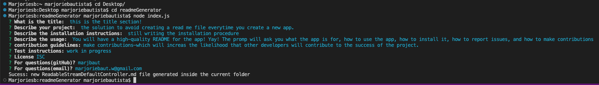

# Professional README Generator 

## Table of Content
-[project description](#Description)
-[usage](#Usage)
-[contributing](#Contributing)
-[installation](#Installation)
-[Questions](#Questions)
-[License](#License)

## Description

I've got the solution to avoid creating a read me file everytime. You can quickly and easily create a README file by using a command-line application to generate one. This allows the project creator to devote more time to working on the project.

## Usage

You will have a high-quality README for the app! Yay! The prompt will ask you what the app is for, how to use the app, how to install it, how to report issues.
## Installation

 with this code you will be able to answer to the prompt question in the console and the read me file will be generated.
## Contributing
make contributions which will increase the likelihood that other developers will contribute to the success of the project. 

## Pictures 

